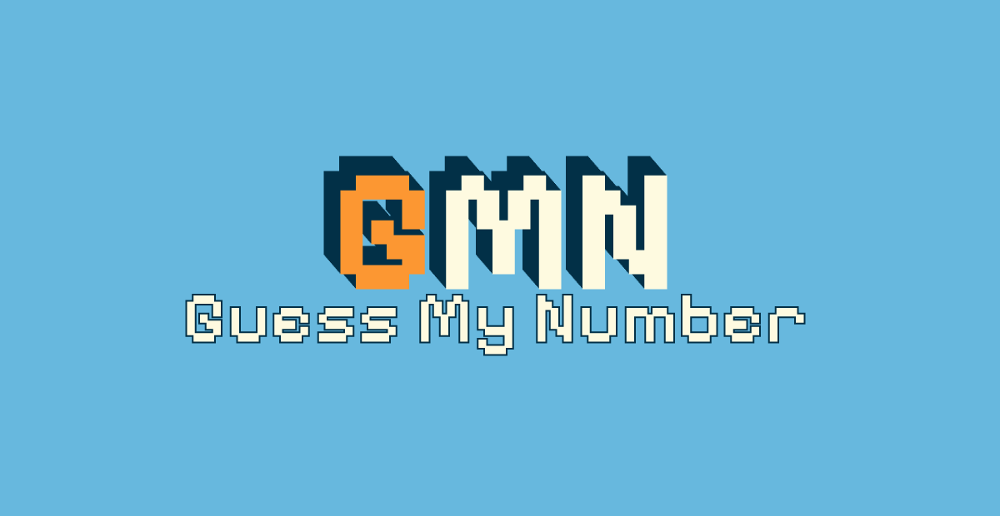

# Guess My Number Game 🎯

**Guess My Number** is the first project from Jonas Schmedtmann's **"The Complete JavaScript Course"**. This fun and interactive number guessing game is built with HTML, CSS, and JavaScript. The objective of the game is simple: guess the randomly generated number between 1 and 20. With each incorrect guess, the player receives a helpful hint indicating whether the guess was too high or too low. The player’s score decreases with each incorrect guess, and the game ends when either the player guesses correctly or the score reaches zero.

## Features 🌟
- **Random Number Generation**: A new random number between 1 and 20 is generated for every game session.
- **Score Tracking**: Each player starts with a score of 20, which decreases with every wrong guess.
- **High Score**: The game keeps track of the highest score across multiple sessions.
- **User Feedback**: The game provides real-time feedback, helping the player adjust their guesses.
- **Interactive UI**: An animated error shake effect and a smooth user interface enhance the gameplay experience.
- **Responsive Design**: Fully responsive design that works across different screen sizes.

## How to Play 🎮
1. Enter a number between 1 and 20 in the input field.
2. Click the "Check" button to submit your guess.
3. The game will tell you if your guess is too high, too low, or correct.
4. If you guess the number correctly, you win! If your score reaches zero, the game is over.
5. Click the "Again" button to start a new game and try again!

## Credits 🙌
- The flat shadow effect was inspired by [Hot Page](https://hot.page).
